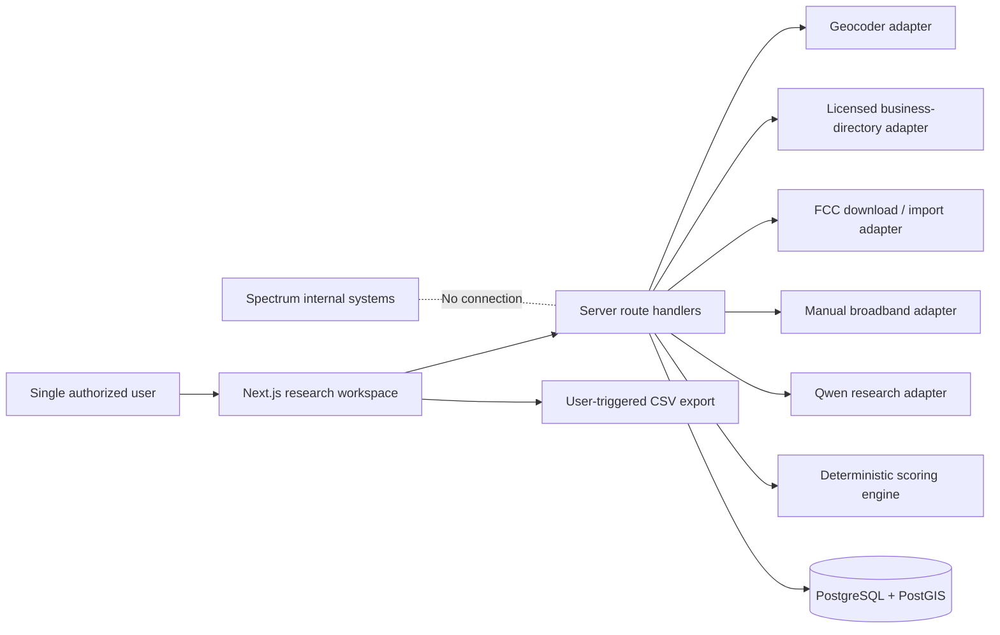

# ProspectIQ — product and implementation blueprint

Prepared August 5, 2026. This is an independent, unofficial, single-user research application that can support Spectrum Business prospecting workflows using public data only. It is not affiliated with Charter/Spectrum and has no connection to Prism or any other Spectrum internal system. See `/COMPLIANCE.md`.

## 1. Proposed system architecture

### Stack

- Next.js App Router, TypeScript, React, and Tailwind CSS.
- Server-only route handlers for geocoding, directory, FCC, and AI calls.
- PostgreSQL with PostGIS in the production phase; browser-local persistence in the Phase 1 prototype.
- Qwen `qwen3.5-flash` through Alibaba Cloud Model Studio's OpenAI-compatible endpoint.
- Provider adapters so business directories, geocoders, maps, broadband sources, and AI models can be changed without rewriting the search workflow.
- CSV creation on an explicit user action; no automatic outreach or data transfer.



### Provider contracts

```ts
interface GeocodingProvider {
  geocode(input: string): Promise<GeocodedAddress>;
}

interface BusinessDirectoryProvider {
  nearby(query: NearbyQuery): Promise<BusinessPage[]>;
  details(externalId: string): Promise<BusinessDetails>;
}

interface BroadbandProvider {
  lookup(subject: LocationSubject): Promise<BroadbandObservation[]>;
  import?(file: File): Promise<ImportResult>;
}

interface ResearchAIProvider {
  generate(facts: ProspectFactPack): Promise<ResearchBrief>;
}
```

Implementations planned or present:

- `GoogleGeocodingAdapter` and `GooglePlacesAdapter` exist as an explicitly disabled reference implementation. They must not be enabled for production prospecting until contractual rights are confirmed.
- A production `LicensedBusinessDirectoryAdapter` must permit lead generation, persistent storage, scoring, CSV export, and AI processing in writing.
- `FccOfficialDownloadAdapter` can retrieve authorized bulk files.
- `FccCsvImportAdapter` will ingest official files with checksums and source vintages.
- `ManualBroadbandAdapter` is working in the prototype.
- `QwenResearchAdapter` is working server-side; Qwen never controls the numeric score.
- Mock/fixture adapters keep local development useful without making real-world claims.

### Search pipeline

1. Validate and normalize the pasted address.
2. Geocode it server-side and retain the provider, confidence, and retrieval time.
3. Create an immutable search run.
4. Query an authorized directory within the selected radius.
5. Normalize and deduplicate by provider ID, then phone/domain plus proximity, then conservative normalized name/address matching.
6. Exclude permanently closed, clearly residential, and out-of-radius records.
7. Attach exact-address broadband observations where possible. Area-level observations remain **Estimated**.
8. Calculate the deterministic, versioned prospect score.
9. Send Qwen a minimized fact pack for prose only. Validate its structured JSON before saving.
10. Store source records, data dates, retrieval dates, adapter status, and sanitized errors.
11. Return partial successful results when one provider fails.

### Security boundary

- Third-party credentials are server-only environment variables and never appear in frontend code or API responses.
- The browser receives normalized fields, not raw provider responses.
- Application logs must redact request headers, credentials, target addresses, and raw payloads.
- Secure cookies, CSRF protection, input validation, output encoding, rate limits, and adapter concurrency limits are required before production.
- Every production row remains scoped by `user_id`, even though the first release has one user.
- Only business-level information is needed. Contact-person or other unnecessary personal data is out of scope.

## 2. Database schema

The executable proposal is in `db/schema.sql`. Enable `postgis`, `citext`, and `pg_trgm`.

| Table | Purpose |
|---|---|
| `users` | Single-user identity now; tenant boundary later. |
| `target_addresses` | Input and normalized address, coordinates, geocoder provenance. |
| `searches` | Immutable search parameters and execution state. |
| `businesses` | Canonical organization identity. |
| `business_locations` | Individual commercial locations, contact fields, hours, and status. |
| `business_external_ids` | Directory-specific IDs used for reliable deduplication. |
| `search_results` | Per-search inclusion, distance, and opportunity. |
| `providers` | Canonical broadband providers and aliases. |
| `broadband_observations` | Technology, speed, geographic scope, dates, confidence, and exact/estimated state. |
| `source_records` | Provenance, terms URL, checksum, freshness, and retention metadata. |
| `business_location_sources` | Field-level source attribution for a business location. |
| `prospect_scores` | Versioned factor values, evidence multiplier, total, and explanation. |
| `research_briefs` | Qwen model/prompt version and validated generated content. |
| `research_brief_sources` | Sources supporting each brief. |
| `saved_prospects` | User shortlist and notes. |
| `manual_corrections` | Auditable user edits with rationale and optional evidence. |
| `data_imports` | FCC CSV import manifest, checksum, counts, and errors. |
| `provider_runs` | Adapter timing, retry, quota, and sanitized-error audit. |
| `audit_events` | User and system events without secret or raw-payload logging. |

Important constraints:

- GiST indexes on target and business-location geography.
- Trigram indexes on normalized names and addresses.
- Nonnegative advertised speeds.
- Exactly one target subject per broadband observation.
- Unique provider/external ID and unique business location per search.
- Entry method (`api`, `import`, `manual`) is separate from evidence state (`verified`, `estimated`, `unavailable`, `stale`).
- Store normalized fields allowed by the provider license; avoid keeping raw payloads unless a short, documented retention window is permitted.

## 3. Required APIs and estimated costs

Prices are list-price estimates as of August 5, 2026 and must be checked again before launch.

| Capability | Proposed source | Current cost assumption | Notes |
|---|---|---:|---|
| Business directory | Commercial provider with explicit lead-generation/storage/export/AI rights | Quote required | The provider contract, not just technical API access, must cover the workflow. |
| Geocoding | Same licensed provider or a separately licensed geocoder | Usage-based or quote | Keep this in its own adapter. |
| Broadband availability files | FCC BDC Public Data API | No published API-call fee | FCC account plus API token required. Address matching is a separate licensing issue. |
| Address-to-FCC Location ID | CostQuest commercial Fabric/Match API | Quote required | No-cost FCC Tier 4 licenses do not fit commercial sales use. |
| AI research copy | Alibaba Model Studio, `qwen3.5-flash`, international scope | $0.10/M input tokens; $0.40/M output tokens | At 1,500 input + 800 output tokens: about $0.00047/brief, or $0.47/1,000 briefs. Promotional/free quotas may apply. |
| Database | PostgreSQL/PostGIS | $0 local; managed hosting varies | Size for normalized data and indexes, not raw provider archives. |

### Google reference pricing and contractual caution

If a legal/contract review specifically authorizes Google Maps Platform for this workflow, current global pricing is:

- Geocoding: 10,000 free monthly requests, then $5 per 1,000.
- Nearby Search Enterprise: 1,000 free monthly requests, then $35 per 1,000. The phone, website, hours, rating, and review fields requested by ProspectIQ trigger the Enterprise SKU.
- Dynamic Maps: 10,000 free monthly loads, then $7 per 1,000.

Nearby Search returns at most 20 results per call, so broad category coverage may require multiple calls. At 1,000 searches per month with four Enterprise Nearby calls each, the rough Places charge is `(4,000 - 1,000) × $0.035 = $105/month`; geocoding and one map load per search remain within the stated free caps.

However, the standard [Google Maps Platform Terms](https://cloud.google.com/maps-platform/terms) restrict indexing, storing, and exporting Google Maps Content; saving business names and addresses; creating content from Maps Content; and use to create or augment an advertising product. Those restrictions conflict with saved prospects, scoring, Qwen briefs, and CSV export. Standard Google Places therefore remains disabled pending written permission or legal approval. See also the [Places policies](https://developers.google.com/maps/documentation/places/web-service/policies), [pricing](https://developers.google.com/maps/billing-and-pricing/pricing), and [SKU field triggers](https://developers.google.com/maps/billing-and-pricing/sku-details).

Qwen pricing source: [Alibaba Cloud Model Studio pricing](https://www.alibabacloud.com/help/en/model-studio/model-pricing).

## 4. Compliant FCC broadband access

### What the public API can do

The official BDC Public Data API is an authorized bulk-download API:

- Base URL: `https://broadbandmap.fcc.gov/api/public`
- `GET /map/listAsOfDates`
- `GET /map/downloads/listAvailabilityData/{as_of_date}`
- `GET /map/downloads/downloadFile/{data_type}/{file_id}`
- Authentication headers: `username` and `hash_value`

An FCC account and generated token are required. Use the [FCC account instructions](https://help.bdc.fcc.gov/hc/en-us/articles/20044640394395-How-to-Create-an-FCC-User-Account), [current API Swagger](https://us-fcc.app.box.com/v/bdc-public-data-api-swagger), and [API specifications](https://us-fcc.app.box.com/v/bdc-public-data-api-spec).

### Critical address-matching boundary

Public fixed-availability downloads use `location_id`; they are not a simple street-address lookup API. Address, coordinate, and building fields require Location Fabric access. FCC Tier 4 Standard is limited to challenge/crowdsource work, while Tier 4 Research is for noncommercial academic/public-policy research. ProspectIQ's sales use does not qualify. See the [FCC Fabric access terms](https://help.bdc.fcc.gov/hc/en-us/articles/10419121200923-How-Entities-Can-Access-the-Location-Fabric).

The production route is a [CostQuest commercial Fabric license](https://www.costquest.com/broadband-serviceable-location-fabric/location-fabric-license-center/fcc-fabric-license/) plus its [Match API](https://apidocs.costquest.com/guides/match/) or another licensed match method. Pricing is quote-only.

### Safe MVP behavior

1. Open the official FCC map in a new tab and copy the address for the user.
2. Let the user manually enter provider, technology, advertised speeds, classification, coverage scope, source date, retrieval date, and limitations.
3. Optionally import official FCC CSVs later. Associate an address only when the user provides a Location ID or commercial matching rights exist.
4. Label transcribed data **Manually entered** and geographic/nearby matches **Estimated**.
5. Never label availability as the business's current provider.
6. Never inherit target-address availability as verified availability for a nearby business.
7. Display conflicting observations side by side.
8. Query available FCC vintages at runtime rather than hard-coding a date.

The FCC describes the map as availability data, not performance, adoption, or affordability. See [How to use the National Broadband Map](https://help.bdc.fcc.gov/hc/en-us/articles/10467446103579-How-to-Use-the-FCC-s-National-Broadband-Map).

ProspectIQ must not automate the map page, read its DOM, call undocumented endpoints, bypass a CAPTCHA, or scrape results.

## 5. Prospect-scoring formula

Run an eligibility gate before scoring:

- Exclude permanently closed, clearly residential, and out-of-radius records.
- Keep temporarily closed records only with a visible warning and optional score cap.
- Missing facts earn zero points. Qwen cannot guess inputs or alter the score.

```text
Score = clamp(round(D + C + N + S + B + Q), 0, 100)
```

| Factor | Points | Rule |
|---|---:|---|
| `D` Distance | 0–15 | ≤0.25 mi: 15; ≤0.5: 12; ≤1: 9; ≤2: 5; ≤5: 2. |
| `C` Category fit | 4–15 | Versioned visible tiers: medical, professional, financial, property, logistics, education = 15; restaurant, retail, repair, construction = 12; other supported commercial = 8; unknown = 4. |
| `N` Network-use signals | 0–20 | Five axes worth 4 each: continuity/POS/VoIP, cloud/video, upload/backups/files, guest Wi-Fi, and multi-user/device load. An industry hypothesis earns 2; explicit public evidence earns 4. |
| `S` Supported scale | 0–10 | Supported employee count earns up to 6; supported location count earns up to 4. Unknown earns 0. |
| `B` Broadband opportunity | 0–30 | Measurable provider choice plus download/upload differences, multiplied by evidence quality. Missing broadband earns 0. |
| `Q` Evidence readiness | 0–10 | Up to 2 each for identity/geocode, category/open status, phone/site, scale/location evidence, and current broadband provenance. |

Broadband raw points:

- Limited non-Spectrum wired alternatives: 0–8 only when dataset completeness supports that conclusion.
- Spectrum candidate download advantage: 0–7 using visible speed ratios.
- Upload advantage: 0–8 using visible speed ratios.
- Need-weighted measurable fit: 0–7.

```text
B = round(BroadbandRaw × EvidenceMultiplier)
```

Evidence multiplier:

- `1.00`: current source-backed exact-address orderability evidence.
- `0.85`: exact official location-level provider-reported observation.
- `0.60`: geographic or nearby-address estimate.
- `0.50`: unsupported manual observation.
- `0.00`: unavailable or unresolved conflicting evidence.

Absence of a competitor record never proves that no competitor exists. Display the score breakdown and a separate evidence-confidence indicator. Persist scoring version and input hash so the result is reproducible.

## 6. Main-screen wireframes

### Research workspace

```text
┌──────────────┬───────────────────────────────────────────────────────────────┐
│ ProspectIQ   │  RESEARCH WORKSPACE                                          │
│              │  Find the businesses worth a closer look.                   │
│ 01 Research  │                                                               │
│ 02 Saved     │  [ Street address................ ] [0.25 mi] [Start research]│
│ 03 History   │                                                               │
│ 04 Sources   │  Prospects     Priority      Avg distance      Verified       │
│              │                                                               │
│ Public-data  │  ┌──────────────────────┐  ┌─────────────────────────────┐    │
│ boundary     │  │ Relative radius map  │  │ Broadband comparison        │    │
│              │  │ monochrome markers   │  │ source + confidence + date  │    │
│ No internal  │  │ blue = selected      │  │ [Add manual observation]    │    │
│ connection   │  └──────────────────────┘  └─────────────────────────────┘    │
│              │                                                               │
│              │  Category chips | Min score | Sort | Export CSV               │
│              │  ┌─────────────────────────────────────────────────────────┐  │
│              │  │ Score  Business  Category  Distance  Opportunity  Status│  │
│              │  └─────────────────────────────────────────────────────────┘  │
└──────────────┴───────────────────────────────────────────────────────────────┘
```

### Prospect detail drawer

```text
┌────────────────────────────────────────────────────────┐
│ Prospect brief                              [close]     │
│ BUSINESS NAME                                 71/100    │
│ Address · Category · Verified/Estimated                  │
│ [Save] [Copy opener] [Directory]                         │
├────────────────────────────────────────────────────────┤
│ Why this score                                          │
│ Distance             ━━━━━━━━━━━ 15/15                  │
│ Category fit         ━━━━━━━━━━━ 15/15                  │
│ Network-use signals  ━━━━━━━━━━  18/20                  │
│ Supported scale      ━━━━━━━━     8/10                  │
│ Broadband            —            0/30                  │
│ Evidence readiness   ━━━━━━       6/10                  │
├────────────────────────────────────────────────────────┤
│ Qwen research brief                [Generate with Qwen] │
│ Summary · Hypotheses · Opportunity · Questions          │
│ Dark, copyable call opener                             │
│ Follow-up email                                        │
├────────────────────────────────────────────────────────┤
│ Broadband comparison · source scope · as-of date        │
│ Provenance and retrieval date                           │
└────────────────────────────────────────────────────────┘
```

The visual system is deliberately black, white, and warm gray. Cobalt marks selection and AI readiness, green marks verified/saved states, amber marks estimates/staleness, and red appears only for errors. Icons are limited to familiar actions such as search, save, copy, external link, and export.

## 7. Legal, privacy, licensing, and terms risks

| Risk | Likelihood / impact | Required control |
|---|---|---|
| Automating the FCC map UI contrary to terms | Medium / High | No DOM automation or scraping; official download/API only after access review; manual/import fallback. |
| Google storage, export, derived-content, and advertising restrictions | High / High | Keep disabled; use a provider contract expressly permitting lead generation, persistence, export, scoring, and AI use. |
| Public-site crawling violates terms or robots rules | Medium / High | No crawling by default; use authorized APIs or user-provided text. |
| Claiming a business's current provider without evidence | Medium / High | Model availability observations only; visible scope/confidence labels; prohibited-claim tests. |
| FCC/provider data is stale, provider-reported, residential, or approximate | High / High | Store source/scope/date; apply staleness policy and evidence multiplier; show conflicts. |
| Qwen invents facts | Medium / High | Minimized structured fact pack, JSON validation, deterministic score, hypothesis labels, human review. |
| Qwen retention/region/cross-border processing | Medium / High | Review vendor DPA and region; send business-only data; allow AI to be disabled. |
| Telemarketing, Do-Not-Call, TCPA, or state-law violations | Medium / High | No auto-dialing/sending; add suppression workflow before any outreach automation; legal review. |
| CAN-SPAM or deceptive email | Medium / High | Draft only; user sends manually; no misleading subject or unsupported personalization. |
| Unnecessary personal information | Medium / High | Business-level records only; no contact-person enrichment in MVP; retention/deletion controls. |
| API key exposure | Low / High | Server-only environment variables, restricted keys, log redaction, client-bundle secret scan. |
| CSV leakage or formula injection | Medium / Medium | Explicit download, no public URL, short-lived browser Blob, escape spreadsheet-formula prefixes. |
| Dedupe merges franchise locations | Medium / Medium | Keep location entities separate; conservative merge; auditable split/correction. |
| Category scoring becomes opaque or biased | Medium / Medium | Versioned visible factors; no protected traits or proxies; manual review. |
| Trademark or implied official endorsement | Low / High | Private/internal positioning and approved brand language; no implication of internal access. |
| Accidental Prism/internal-system interaction | Low / High | No connector, URL, credential, import, or automation path for internal systems. |
| Provider quota/cost spike | Medium / Medium | Radius/result caps, details on demand, budget alarms, rate limits, adapter audit. |
| Raw provider payload retention breaches license/privacy | Medium / Medium | Persist only permitted normalized fields; short encrypted TTL only when allowed. |

Formal provider-terms, outreach-compliance, security, and privacy review is required before production use.

## 8. Step-by-step MVP implementation plan

1. **Compliance and configuration gate**
   - Inventory credentials without exposing values.
   - Approve directory/geocoder usage rights and FCC mode.
   - Enforce public-data and internal-system boundaries.
   - Acceptance: missing optional providers produce a safe, explicit state.
2. **Foundation and persistence**
   - Scaffold Next.js, TypeScript, Tailwind, auth, PostgreSQL/PostGIS migrations, adapter interfaces, and fixtures.
   - Add source, adapter-run, and audit tracking.
   - Acceptance: secrets do not appear in client bundles and every persisted row is user-scoped.
3. **Phase 1 search**
   - Address input, server-side geocoding, radius, authorized nearby search, normalization, dedupe, map, filters, table, and CSV export.
   - Acceptance: invalid addresses, zero results, missing fields, duplicates, rate limits, and partial provider failures show explicit states without fabrication.
4. **Phase 1 polish**
   - Quota limits, partial progress, keyboard/responsive behavior, immutable search snapshots, accessibility.
5. **Phase 2 broadband**
   - Manual entry first, then official FCC CSV import with manifest, then official network adapter after access review.
   - Add conflict, scope, source-date, and staleness handling.
6. **Phase 3 scoring**
   - Implement and test versioned category/need rules, exact factor breakdown, input hash, evidence multiplier, and confidence.
7. **Phase 3 Qwen research**
   - Strict structured output, minimized facts, deterministic fallback, unsupported-claim validation, and source tracing.
8. **Phase 4 workflow**
   - Saved prospects, notes, immutable history, manual corrections, improved dedupe, reporting.
9. **Release hardening**
   - Unit, integration, end-to-end, accessibility, secret, CSV, security, licensing, and outreach-compliance testing.

## 9. Working Phase 1 prototype

Implemented now:

- Responsive black-and-white research workspace with restrained cobalt/green/amber accents.
- Address input and 0.25, 0.5, 1, 2, and 5 mile radius options.
- Server-side research route with validation and explicit demo fixture fallback.
- Relative radius map with target and score markers.
- Category filters, minimum score, sort controls, explainable results table, and CSV export.
- Prospect detail drawer with factor-by-factor score, hypotheses, discovery questions, call opener, email draft, and sources.
- Validated server-only Qwen `qwen3.5-flash` adapter with JSON output validation and deterministic template fallback.
- Manual broadband entry with provider, technology, speeds, classification, scope, source/as-of date, retrieval date, and confidence.
- Saved prospects and search history in browser-local storage.
- Data-source status screen and explicit no-internal-system boundary.
- Demo records and illustrative broadband values are visibly labeled and cannot be mistaken for live facts.

Not production-complete:

- No contractually approved live business-directory provider has been selected.
- No commercial CostQuest Fabric/Match API license or FCC token is configured.
- PostgreSQL/PostGIS and authentication are proposed but not connected.
- Browser-local history stores metadata, not immutable full snapshots.
- The relative map is a research visualization, not a licensed navigation basemap.

